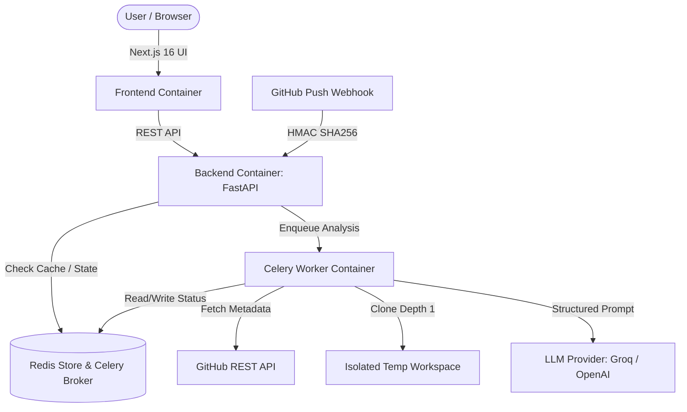

# 🌿 CodeViz AI

> **AI-Powered Codebase Architecture & Mermaid Diagram Generator**

CodeViz AI is a full-stack developer tool that clones GitHub repositories, analyzes source files, uses Groq `llama-3.3-70b-versatile` (or OpenAI) to infer software architecture patterns, and renders interactive Mermaid architecture diagrams with an integrated file explorer and PDF/PNG export options.

---

## 🏗️ System Architecture



---

## ✨ Features

- 🤖 **AI Architecture Analysis**: Generates Mermaid diagrams, key architectural patterns, components, and summaries using Groq `llama-3.3-70b-versatile` (or OpenAI `gpt-4o-mini`).
- ⚡ **Background Worker Queue**: Uses Celery + Redis for reliable, isolated background processing with automatic retries and timeouts.
- 🔑 **SHA-based Caching**: Automatically hashes `(repo_url, branch, commit_sha)` to serve instant cached architecture analyses for unchanged commits.
- 🛡️ **Security & Abuse Protection**:
  - Domain host verification (GitHub validation).
  - Pre-flight repository size capping (`MAX_REPO_SIZE_MB`, default 200MB).
  - IP-based rate limiting via `slowapi`.
  - Secure HMAC `X-Hub-Signature-256` webhook verification.
- 📂 **Interactive File Explorer**: Explore repository file trees and inspect file contents side-by-side with architecture diagrams.
- 📤 **Diagram Export & Sharing**: Export high-resolution PNGs, A4 landscape PDFs, or generate shareable direct links (`/?id=...`).

---

## 🛠️ Technology Stack

| Layer | Technology |
| :--- | :--- |
| **Frontend** | Next.js 16, React 19, Tailwind CSS, Lucide Icons, Mermaid.js |
| **Backend API** | Python 3.11/3.13, FastAPI, SlowAPI, Pydantic v2 |
| **Task Queue & Cache**| Celery, Redis 7 |
| **LLM Integration** | Groq (`llama-3.3-70b-versatile`), OpenAI (`gpt-4o-mini`) |
| **Containerization** | Docker, Docker Compose |

---

## 🚀 Quick Start (Docker Compose)

The easiest way to run CodeViz AI with Redis, Celery, Backend, and Frontend is using Docker Compose:

1. **Clone the repository:**
   ```bash
   git clone https://github.com/vaibhav-aiml/codeviz-ai.git
   cd codeviz-ai
   ```

2. **Configure Environment Variables:**
   Copy the example environment file:
   ```bash
   cp .env.example backend/.env
   ```
   Open `backend/.env` and set your `GROQ_API_KEY`:
   ```env
   GROQ_API_KEY=gsk_your_actual_groq_api_key
   ```

3. **Launch Stack:**
   ```bash
   docker-compose up --build
   ```

4. **Access Applications:**
   - **Frontend UI**: [http://localhost:3000](http://localhost:3000)
   - **Backend API Docs**: [http://localhost:8000/docs](http://localhost:8000/docs)

---

## 💻 Local Development (Without Docker)

### Backend Requirements & Setup

1. **Start a local Redis server** (e.g. via `docker run -p 6379:6379 redis:7-alpine` or native Redis).
2. **Setup virtual environment & dependencies:**
   ```bash
   cd backend
   python -m venv venv
   # Windows:
   .\venv\Scripts\activate
   # Linux/macOS:
   source venv/bin/activate

   pip install -r requirements.txt
   ```
3. **Run Celery Worker:**
   ```bash
   celery -A app.tasks.celery_app worker --loglevel=info
   ```
4. **Run FastAPI Server:**
   ```bash
   uvicorn app.main:app --reload --port 8000
   ```

### Frontend Requirements & Setup

1. **Install Node dependencies:**
   ```bash
   cd frontend
   npm install
   ```
2. **Run Dev Server:**
   ```bash
   npm run dev
   ```

---

## ⚙️ Environment Variables Reference

| Variable | Description | Default |
| :--- | :--- | :--- |
| `GROQ_API_KEY` | Groq API Key for LLM inference | Required (if `LLM_PROVIDER=groq`) |
| `GITHUB_TOKEN` | GitHub PAT for higher API rate limits | Optional |
| `REDIS_URL` | Redis connection URL | `redis://localhost:6379/0` |
| `ALLOWED_ORIGINS` | Comma-separated CORS allowed origins | `http://localhost:3000` |
| `MAX_REPO_SIZE_MB` | Maximum repository size in MB allowed | `200` |
| `RATE_LIMIT_PER_MINUTE` | Per-IP request limit per minute for `/api/analyze` | `5` |
| `SENTRY_DSN` | Sentry DSN for backend error tracking | Optional |
| `GITHUB_WEBHOOK_SECRET` | Secret for HMAC signature validation on webhooks | Optional |
| `LLM_PROVIDER` | LLM provider choice (`groq` or `openai`) | `groq` |
| `OPENAI_API_KEY` | OpenAI API Key | Optional (if `LLM_PROVIDER=openai`) |

---

## 🧪 Testing

### Backend Unit & API Tests
```bash
cd backend
pytest -v -o pythonpath=.
```

### Frontend Vitest Suite
```bash
cd frontend
npm run test
```

---

## 📄 License

Distributed under the MIT License. See [`LICENSE`](./LICENSE) for more information.
